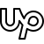

     

## About Me
I write code that lets robots perceive, think, move, and interact. Whether it is a robotic arm, an autonomous car, or a humanoid, I’m passionate about programming intelligent machines that operate in the real world alongside humans.

&nbsp;

## Featured Projects

### Autonomous Disassembly of E-waste

<!--
<iframe width="560" height="315" src="https://www.youtube.com/embed/DrsZcyIvMZc" 
title="E-waste" frameborder="0" allow="accelerometer; autoplay; clipboard-write; encrypted-media; gyroscope; picture-in-picture" 
allowfullscreen></iframe>
-->

<iframe width="560" height="315" src="https://www.youtube.com/embed/62MTDgTppc8" 
title="E-waste" frameborder="0" allow="accelerometer; autoplay; clipboard-write; encrypted-media; gyroscope; picture-in-picture" 
allowfullscreen></iframe>

* Description: An autonomous disassembly system for automating the extraction of precious material from waste laptops.  
* My contributions: Hardware integration and calibration. Force-velocity control. Motion and task planning.

&nbsp;

### LiDAR-SLAM with Radiance Fields
<iframe src="https://drive.google.com/file/d/1eoNPhTmsV6DeehVJ_K99gvGUSCbHaalJ/preview" width="560" height="315" allow="autoplay"></iframe>

* Description: Achieve higher accuracy in LiDAR SLAM by utilising NeRFs and Gaussian Splatting.
* My contributions: LiDAR bundle adjustment method based on Neural Distance Fields.

&nbsp;

### Visual Anomaly Detection for Industrial Inspection

<iframe src="https://drive.google.com/file/d/18piHPMOHiVuw4_q67KtvMg55_synpeVa/preview" width="560" height="315" allow="autoplay"></iframe>
* Description: Survey on recent anomaly detection methods on industrial inspection tasks.
* My contributions: Trained different anomaly detection models (GANs, VAEs, ViT, Diffusion Models, Normalizing Flow) on different industrial inspection datasets to get insights of current SOTA models.

&nbsp;

## Experiences
* Robert Bosch GmbH (Aug 2023 - Feb 2025) 
  * Researched Neural Reconstruction for LiDAR SLAM.
  * Tested motion planning algorithms for level 4 autonomous driving.
    
* Circu Li-ion (Oct 2022 - Mar 2023) 
  * Programmed ABB robots to disassemble EV batteries.

    
* Robotics and Control Lab, Ain Shams University (Sep 2020 - Aug 2021) 
  * Programmed ABB robots to autonomously disassemble laptops.
  * Taught ROS for industrial robots.
    
* Upwork (Mar 2020 - Mar 2023) 
  * Delivered robotics solutions, from hardware integration to high-level tasks, to more than 15 clients worldwide.

## Education
* MSc. Autonomous Systems, Hochschule Bonn-Rhein-Sieg, Germany
* BSc. Mechatronics Engineering, Ain Shams University, Egypt

## Fields of Experience
* Manipulation: Tactile Sensing, Trajectory Planning
* 3D Perception: 3D LiDAR SLAM, Point Cloud Registration, Gaussian Splatting, Neural Radiance Fields
* Computer Vision: Visual Anomaly Detection

## Technologies
* Robotics: ROS 1/2, Moveit, Gazebo, ABB RobotStudio, Nvidia Jetson
* Software Development: C++, Python, CMake, Docker, Linux, Agile, Git, CI/CD, Unit Testing
* Computer Vision: OpenCV, PCL, Open3D, Pytorch

## Hobbies
* Chess
* Ping-pong
* Hiking
* Programming robots
